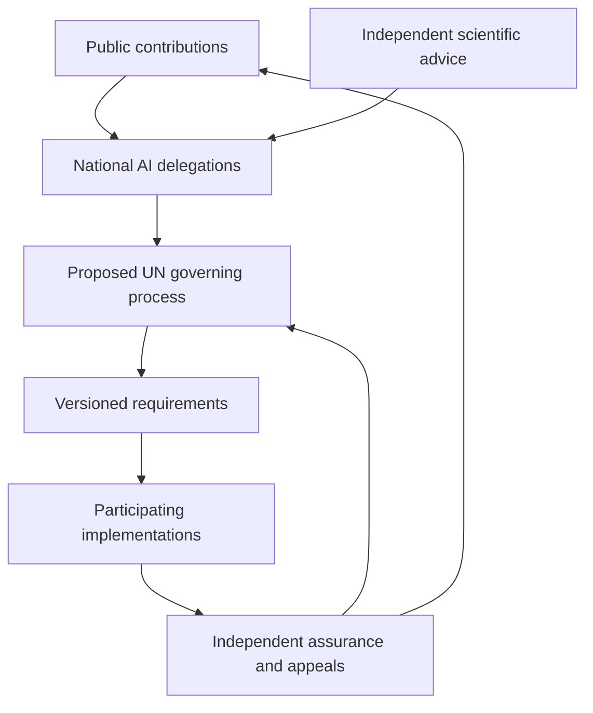
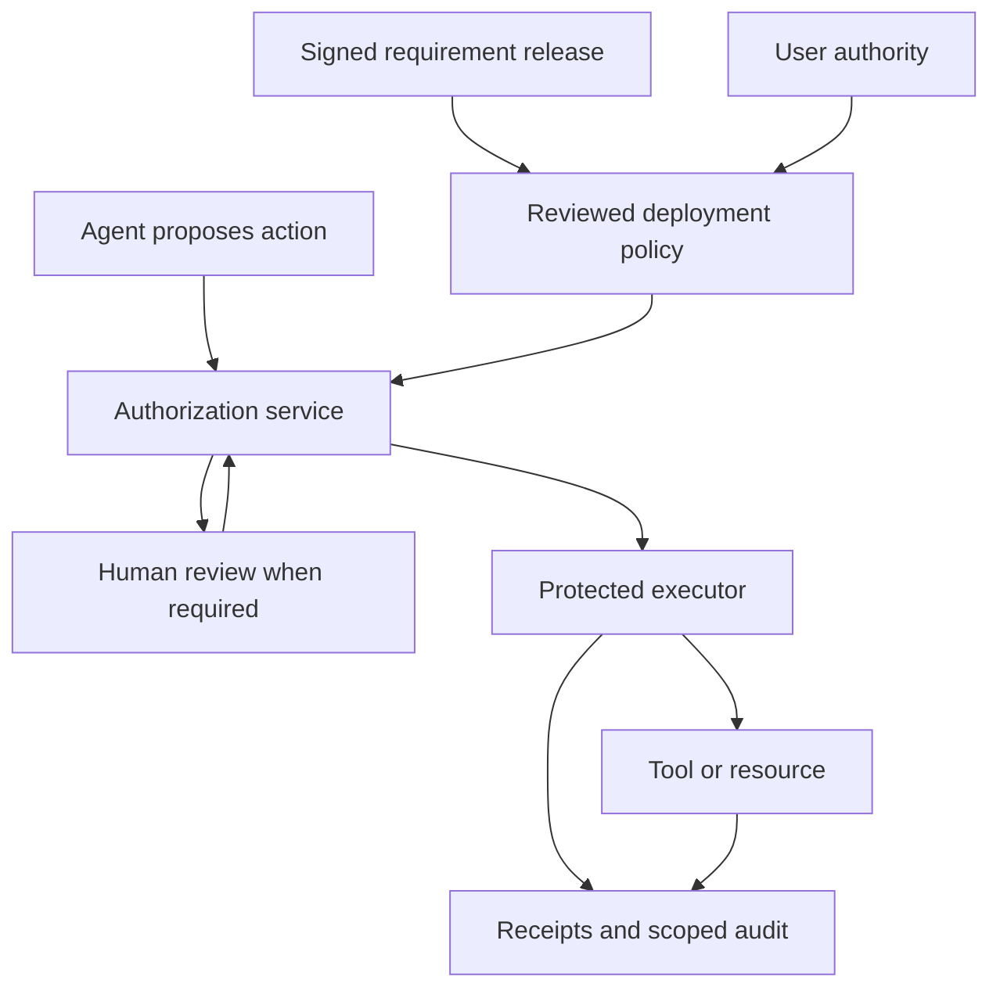

# AI for Peace and Humanity

## Proposed international governance and security architecture

Evan Alexander Prawda · Concept draft 0.1 · 2026-09-25

**Independent proposal for a future UN-governed framework. No UN affiliation, endorsement, mandate, adoption, or lab participation is claimed.** Institutional arrangements below are proposals, not descriptions of existing UN powers. The technical design is experimental, not deployed or independently security-reviewed.

## 1. Purpose and organizing principle

Enable beneficial AI across the web, public services, science, and the economy while making consequential actions subject to accountable authority, proportionate safeguards, and accessible remedy. Peace, human dignity, rights, and broadly shared opportunity provide the purpose; precise requirements and accountable institutions provide the operating mechanisms.

The proposed division of responsibility is: **UN stewardship of agreed requirements; national AI delegations; public contribution; independent scientific advice; implementation by participating labs and technology providers; independent verification and appeal.**

This is a framework of interoperable protocols and institutional commitments. A single wire protocol cannot make a model truthful, resolve international political disagreements, or determine whether every possible action is humane. Low-impact tasks should remain easy to use, while controls grow with the consequences and uncertainty of the action.

## 2. Existing foundation and additional mandate

The General Assembly established the Independent International Scientific Panel on AI and Global Dialogue on AI Governance through Resolution A/RES/79/325. The Dialogue brings governments and other stakeholders together. Its official FAQ explicitly describes it as a non-negotiating forum that concludes with co-chair summaries, rather than binding agreements. [U1–U2]

The governing and assurance functions proposed here would therefore require an additional agreed mandate or another explicit institutional arrangement. They must not be presented as powers of the current Dialogue. Scientific advice can inform deliberation without giving scientific advisers authority to legislate or decide individual appeals.

## 3. Proposed institutional structure

| Body | Composition and role | Limits and accountability |
|---|---|---|
| Governing assembly under an agreed UN mandate | Member-state delegations adopt the charter, requirements, budgets, and revision procedures | Publishes reasons, votes, dissent, and conflicts; authority confined to the adopted mandate |
| National AI delegations | Each country appoints government representatives plus AI researchers, engineers, and public-interest expertise; industry leaders may participate | Published selection criteria, conflict disclosures, recusals, fixed terms; companies do not acquire national votes |
| Public contribution forum | Individuals, communities, academics, workers, civil society, startups, and companies submit proposals and evidence | Multilingual access, documented responses, transparent moderation, appeal; popularity is not scientific evidence |
| Independent scientific advice | Independent experts assess evidence, uncertainty, measurement quality, and consequences | Advice and uncertainties published; distinct from national negotiating roles |
| Technical standards groups | Engineers, standards specialists, security researchers, and domain experts define profiles and tests | Open drafts, interoperability evidence, disclosed commercial interests, no unilateral production access |
| Assurance and appeals function | Independent assessors and rights experts investigate within a defined remit and review contested decisions | Separation from implementers and original decision-makers; procedural fairness and confidential channels |
| Secretariat | Coordinates documentation, translation, release records, consultations, and administrative support | Published budget and funding sources; cannot alter requirements or issue execution permits unilaterally |

Member-state decision procedures, quorum, adoption thresholds, appointment rules, and legal authority must be negotiated. This sketch does not silently assign Security Council powers or invent a veto structure. Material technical releases would require both the mandated policy decision and published technical validation; unresolved technical failures would be disclosed rather than concealed by a vote.

Fund participation for countries and communities without frontier labs. Provide shared testing infrastructure, translation, and independent technical assistance. Funding must not purchase rulemaking authority. Publish donations and require recusal where appropriate.

## 4. Public proposal and revision process

1. **Submit:** identify the problem, affected people, evidence, proposed requirement, expected benefits, costs, and alternatives. Allow protected reporting where publication would expose a person or vulnerability.
2. **Triage:** assess scope, duplications, safety of disclosure, and conflicts. Publish a reason for acceptance, deferral, or rejection.
3. **Consult:** publish a multilingual draft and a defined comment period. Solicit affected communities rather than relying only on well-resourced respondents.
4. **Evaluate:** independent advisers review evidence; technical groups produce measurable tests and report failure modes.
5. **Pilot:** participating implementers test in bounded environments, with published results and limitations.
6. **Decide:** the authorized governing process adopts, revises, or rejects the proposal with a rationale and dissent record.
7. **Release:** publish a versioned requirement, implementation deadline, scope, compatibility policy, tests, and review date.
8. **Reassess:** monitor incidents, exclusion, implementation burden, and unintended effects; allow appeal and amendment.

An emergency process must have a narrowly defined trigger, multiple authorized decision-makers, limited scope, expiry, recorded reasons, and retrospective independent review. It must not become a permanent route around public deliberation. Working response deadlines and appeal targets would be agreed in the charter, not implied by this document.

## 5. From a human commitment to an executable control

| Level | Example | Required evidence |
|---|---|---|
| Charter commitment | People retain meaningful authority over consequential delegated actions | Public rationale, rights analysis, responsible institution |
| Adopted requirement | Specified transfers above a locally defined bound require authorized human review | Exact applicability, exceptions, appeal, measurement method |
| Technical profile | Bind approval to amount, recipient, purpose-relevant context, and expiry | Versioned schema, verifier requirements, adversarial tests |
| Deployment policy | This tenant permits an agent to refund an order within an explicit limit | Signed policy version, resource ownership, authorized reviewer roles |
| Execution | One approved refund is attempted once | Admission record, downstream outcome, reconciliation evidence |

Normative language cannot simply be compiled into code with guaranteed correctness. Each translation needs a human-reviewed mapping that exposes interpretation choices and unautomated obligations. A model may assist analysis, but its output cannot independently issue policy authority or approve a protected action.

## 6. Architecture and trust boundaries

The international framework publishes requirements and associated verification profiles. Each participating operator maintains its own constrained authorization and execution services. Ordinary private prompts and transactions do not pass through a UN server.

The first diagram describes proposed institutional authority; the second describes a deployment's runtime boundary. International policy-release keys do not confer authority to move an individual's funds, access their records, or impersonate their agents.

## 7. Security protocol components

The runtime details are in [SECURITY-ARCHITECTURE.md](SECURITY-ARCHITECTURE.md). The components have distinct maturity:

| Component | Function | Status |
|---|---|---|
| Requirement release manifest | Binds adopted text, scope, tests, effective dates, and authorized release signatures | Concept; no schema or verifier yet |
| Deployment policy mapping | Connects applicable requirements, resource policies, user authority, and reviewer roles | Concept; policy semantics remain domain-specific |
| GAP exact-action profile | Identity, action digest, permit, review, admission, revocation, receipt, recovery | Written v0.1 draft with schemas; no runtime implementation |
| Cross-organization trust profile | Defines accepted issuers, responsibilities, identity mapping, and constraints | Future work; prohibited by current GAP core |
| Assurance record profile | States what system/version/configuration was tested, by whom, with what exceptions | Concept; not a general safety certificate |
| Blockchain execution profile | Binds chain, assets, calls, replay protection, and finality | Future work; not covered by the refund profile |

Existing HTTPS, established cryptography, identity infrastructure, MCP/A2A adapters, and financial rails remain relevant. The proposal does not require a new cryptocurrency, globally centralized identity database, or new transport encryption scheme.

## 8. Adoption, enforcement, and remedies

Each obligation identifies its instrument: voluntary commitment, contract/procurement requirement, enacted national requirement, or other agreed legal mechanism. Participation itself does not establish that every provision is legally binding. Legal enforceability and cross-border remedies require jurisdiction-specific assessment before deployment.

Participating labs would address model evaluation, release documentation, incident reporting, and integrations; providers and deployers would enforce permissions and isolate credentials; tool owners would validate requests at the resource boundary; independent assessors would verify defined controls. No single actor can discharge the others' responsibilities by displaying a badge.

Possible consequences within an adopted scheme include corrective-action plans, suspension of a scoped assurance claim, and referral to competent authorities. Decisions need notice, evidence handling, proportionality, appeal, and periodic review. The framework does not invent direct worldwide police powers.

An affected person should be able to contest an automated restriction or consequential action without understanding cryptography. Remedy may require correcting a record, restoring access, reversing a reversible transaction, or pursuing compensation through a competent mechanism. A signed log is evidence, not a remedy by itself.

## 9. Civil liberties, privacy, and misuse of governance

The charter should protect privacy, freedom of expression, nondiscrimination, access to beneficial technology, and meaningful contestability. Vague labels such as “dangerous” cannot substitute for precise requirements and reviewable evidence. National participation does not justify unlimited surveillance or suppression of lawful research and dissent.

Publish policies and aggregate assurance findings while keeping personal records access-controlled. Retain the minimum evidence necessary for the identified purpose and retention schedule. Hashes and pseudonyms can still leak information or enable linkage; do not publish them indiscriminately. Independent researchers need safe reporting channels and clear permission boundaries for testing.

Conflict among applicable requirements must be surfaced for accountable resolution. An automated “most restrictive wins” rule alone cannot resolve incompatible rights or legal duties. Pending resolution, constrain the affected operation with a documented reason and available human process, rather than silently weakening the governing baseline.

## 10. Demonstration and staged development

**Stage A — consultation package:** this framework, threat model, draft GAP specification, reference mapping, unresolved institutional decisions, and explicit limits. Seek criticism of both the premise and design.

**Stage B — technical prototype:** one synthetic refund adapter, one authority, one executor, real test-only signatures and certificates, a durable admission store, and fault injection. Implement the 32 cases in CONFORMANCE.md.

**Stage C — independent reproduction:** two implementations of the same profile; test changed inputs, revoked approvals, tenant isolation, repeated requests, partitions, and crashes. Report invalid effects, false denials, latency, recovery time, and accessibility of human review.

**Stage D — scoped organizational pilot:** participant agreements, real operational responsibilities, reviewed policies, incident handling, privacy protections, and independent assessment. This is separate from claiming UN adoption.

**Stage E — institutional consideration:** present evidence through an appropriate available consultation or partnership route. Any UN mandate, broader adoption, or international agreement remains a decision for the relevant institutions.

Progress depends on evidence and agreement, not a promised calendar. The current deliverable completes part of Stage A only.

## 11. Research questions and decision register

- Would an implementation profile of existing work be more useful than a new standard?
- Which governing mandate and adoption mechanism would be legitimate and feasible?
- How are national technical delegates selected and public objections meaningfully answered?
- Which commitments are mechanically testable, and which require ongoing institutional judgment?
- How do policies preserve rights across jurisdictions without unchecked override powers?
- Who independently funds and evaluates assessors, and who reviews their decisions?
- How can small providers and low-resource countries implement requirements affordably?
- Which release-signing, key-recovery, federation, and revocation models withstand real attacks?

## 12. Sources and document status

U1. [UN AI Panel and Dialogue — terms and modalities](https://www.un.org/global-digital-compact/en/ai). Establishment of the existing mechanisms.

U2. [Global Dialogue on AI Governance FAQ](https://www.un.org/global-dialogue-ai-governance/en/faq). Participation and the non-negotiating nature of the Dialogue. Accessed through indexed official content on 2026-09-25; direct page retrieval returned an access error.

Technical sources and overlapping proposals are in [RELATED-WORK.md](RELATED-WORK.md). The security architecture distinguishes new proposals from the existing draft. No empirical result, institutional partnership, or legal conclusion is supplied by this concept document. AI-assisted drafting; author and specialist review remain pending. Existing repository licensing is unchanged.
